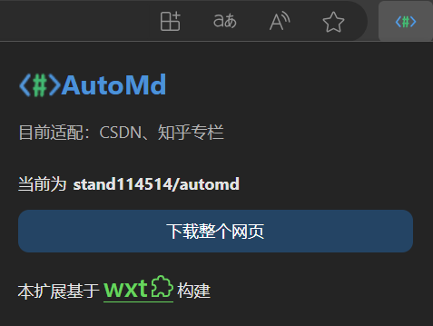

English | [中文](README.md)

    
    <h1>Auto Md</h1>

 

Auto Md is a browser extension that converts web page content to Markdown format and downloads it. It supports Chromium and Firefox browsers, and uses the Turndown library for HTML to Markdown conversions.

## Function

- Convert the current web page content to Markdown format.
- Automatically download the converted Markdown file.
- Supports multiple browsers: Chromium and Firefox.

## Currently adapted

- CSDN
- Zhihu column
- Zhihu answer
- cnblogs
- Full web page parsing

## Tech stack

- **Frontend**: Vue 3 + TypeScript
- **Build Tools**: Vite
- **Conversion Library**: Turndown
- **Framework**: WXT

## Installation

### Chrome  / Edge

1. Download the compiled version of [Releases](https://github.com/stand114514/automd/releases) and unzip it
2. Open Developer Options
3. Load the unzipped extension

## License

This project is licensed under the MIT license.

## Thanks

- [Turndown](https://github.com/turndownjs/turndown) - HTML to Markdown converter.
- [Vue 3](https://vuejs.org/) - The Progressive JavaScript Framework.
- [WXT](https://wxt.dev/) - Next-gen Web Extension Framework.